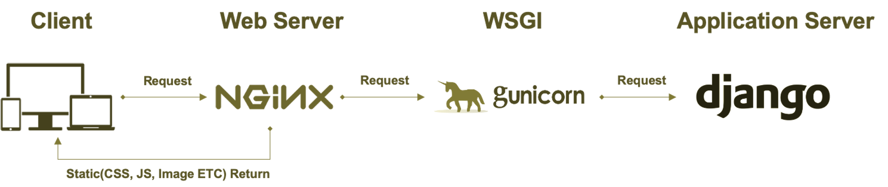
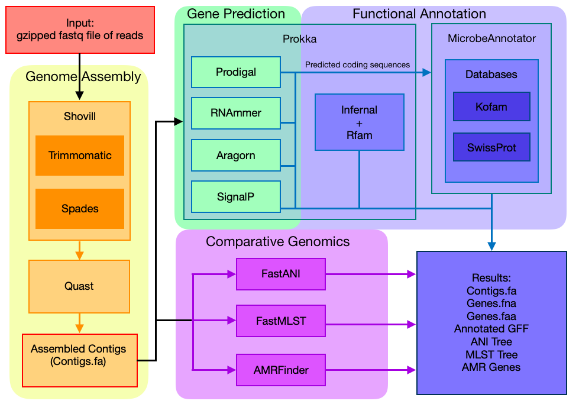

# Team2-WebServer
Team Members:

Chen, Wei-An
Lee, Nathaniel A
Nishiura, Kenji
Ravindra Raju, Dinesh
Srikrishnan, Sreenath
Sun, Zhaoyu
Narasimhan, Harini
---------------------------------

## Email setting<br />
1. Please go to `team2webserver/settings.py` for Gmail host setup.
2. Switch on [google security setting](https://myaccount.google.com/intro/security) 
3. Type in the host user name for _**send_email**_ under _**genome assembly**_ function in `team2webserver/views.py`.


## Webserver Overview


1. Navigate to http://groupb.bioappgenome22.biosci.gatech.edu
2. Upload fastq reads files
3. Enter email and submit job
4. Once the pipeline is complete, you will receive an email with a link to a page with job results. These results can be downloaded as a tar file.

### Tech Stack
1. Django
   *  Installation <br/>
   ``` python -m pip install Django ```
   * Ready-made components that help developers rapidly build websites
   * Common features:  user authentication, file upload, SQL database, test server, etc
   * Model-View-Template architecture
      * Model handles data between the database and the view
      * Views receive the data as well as a request from the client and then accordingly process the data in the database via the models
      * Templates (HTML pages) contain the data output response from the views and are then rendered by the browser at the specified URL
2. Nginx
   *  Installation <br/>
  ``` sudo apt install nginx ```
   *  Interface between frontend and backend
   *  Provides HTTP server capabilities
   *  Webserver that facilitates reverse proxying, caching and load balancing
   *  More resource friendly than Apache
3. HTML & CSS
   *  Markup language for creating web pages
   *  Consists of a series of elements which tell the browser how to display the contents
   *  Cascading Style Sheets is a style sheet language which describes how elements should be rendered on screen
4. Gunicorn
   * Installation <br/>
   ``` python -m pip install gunicorn ```
   * Python-based Web Server Gateway Interface (WSGI) server
   * Natively supports Django
   * Forwards http requests from reverse proxy (Nginx) to backend framework (Django)


## Finalized Pipeline


### Tools

These tools were chosen based on results from the previous groups in addition to ease of use and installation.
They were all installed via conda. The necessary conda environments can be created using the Backend/conda_env_creation.py script.

1. Genome Assembly
   * Shovill: Trims reads with trimmomatic, then assembles with Spades.
   * Quast: Evaluates assembly quality.
2. Gene Prediction
   * Prokka: Uses five different tools to predict coding and noncoding sequences. Also performs some functional annotation.
3. Functional Annotation
   * MicrobeAnnotator: Annotates coding sequences by searching them against the Kofam and Swissprot databases. The --light option is supplied
4. Comparative Genomics
   * FastANI: Calculates pairwise ANI values between all the samples uploaded. Produces a phylogenetic tree based on the results.
   * FastMLST: Calculates MLST for all samples. Produces a tree based on the results.
   * AMRFinder: Identifies antimicrobial resistance genes.

### Refrences
1. X. Chi, B. Liu, Q. Niu and Q. Wu, "Web Load Balance and Cache Optimization Design Based Nginx under High-Concurrency Environment," 2012 Third International Conference on Digital Manufacturing & Automation, 2012, pp. 1029-1032, doi: 10.1109/ICDMA.2012.241.
2. Juneau, J., Baker, J., Ng, V., Soto, L., Wierzbicki, F. (2010). Web Applications With Django. In: , et al. The Definitive Guide To Jython. Apress. https://doi.org/10.1007/978-1-4302-2528-7_14
3. Duckett, J. (2011). HTML & CSS: design and build websites (Vol. 15). Indianapolis, IN: Wiley.

    
    


